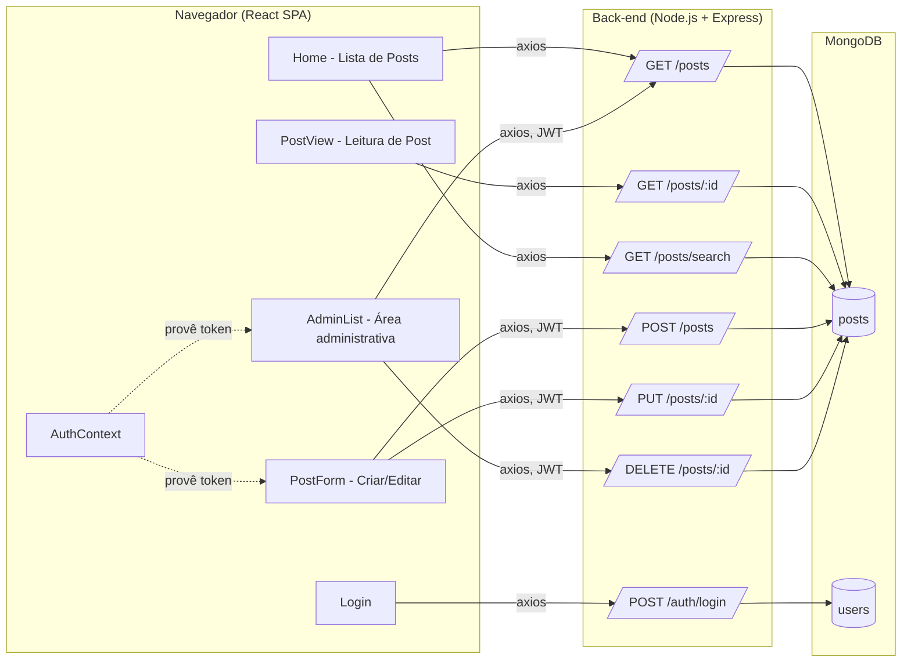
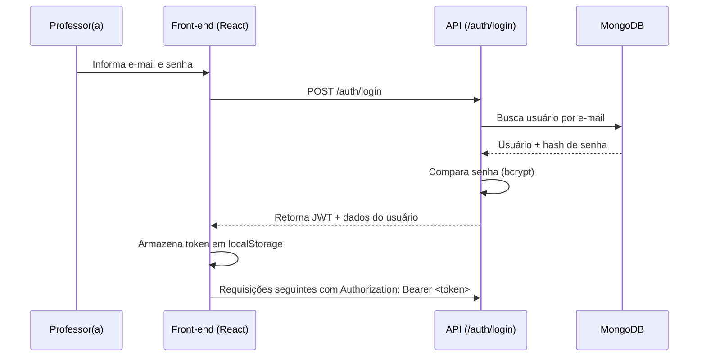
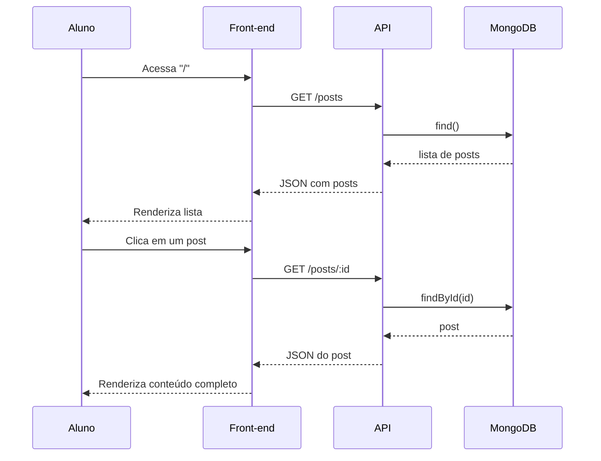

# Arquitetura da Aplicação — Blog da Escola

## Visão geral

A aplicação evoluiu em três fases:

| Fase | Entrega | Tecnologia |
|------|---------|------------|
| 01 | Protótipo de CRUD de posts | OutSystems |
| 02 | API REST + persistência | Node.js, Express, MongoDB |
| 03 | Interface gráfica | React, React Router, Styled Components, Context API |

Esta pasta documenta a **Fase 03**, que consome os endpoints REST criados na Fase 02.

## Diagrama de componentes



## Fluxo de autenticação



## Fluxo de uma postagem



## Decisões técnicas

- **Banco de dados**: MongoDB (NoSQL), pela flexibilidade do schema de posts e simplicidade de operação com Mongoose.
- **Autenticação**: JWT (JSON Web Token) assinado no back-end, armazenado no `localStorage` do front-end e anexado via header `Authorization: Bearer <token>` em toda requisição protegida (criar, editar, excluir posts).
- **Estilização**: Styled Components, para escopo de CSS por componente e fácil theming.
- **Gerenciamento de estado**: Context API (`AuthContext`), suficiente para o escopo do projeto — sem necessidade de Redux.
- **Roteamento**: React Router v6, com rota protegida (`PrivateRoute`) redirecionando usuários não autenticados para `/login`.
- **Containerização**: cada camada (backend, frontend, banco) roda em um contêiner Docker isolado, orquestrados via `docker-compose.yml` na raiz do repositório.
- **CI/CD**: GitHub Actions roda lint/testes do backend, build do frontend e build das imagens Docker a cada push/PR nas branches `main` e `develop`.

## Estrutura de pastas

```
tech-challenge/
├── backend/            # API REST (Node.js + Express + MongoDB)
│   ├── src/
│   │   ├── config/      # conexão com banco
│   │   ├── controllers/ # regras de negócio
│   │   ├── middleware/  # auth, tratamento de erros
│   │   ├── models/      # schemas Mongoose
│   │   └── routes/      # definição das rotas REST
│   └── tests/           # testes automatizados (Jest + Supertest)
├── frontend/            # SPA React
│   └── src/
│       ├── api/          # cliente axios
│       ├── components/   # componentes reutilizáveis
│       ├── context/       # AuthContext
│       ├── pages/         # páginas da aplicação
│       └── styles/        # estilos globais
├── docs/                # esta documentação
├── .github/workflows/   # pipeline de CI/CD
└── docker-compose.yml   # orquestração dos serviços
```
